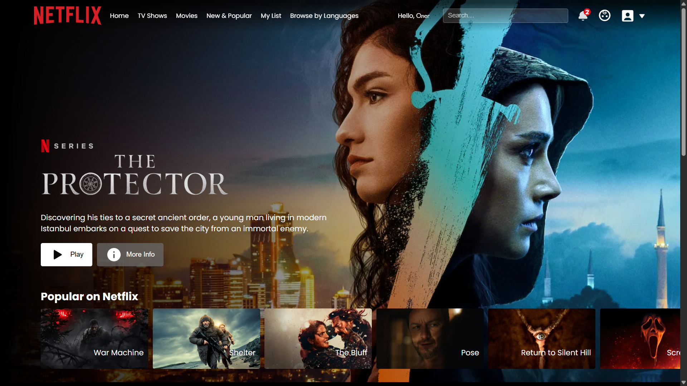
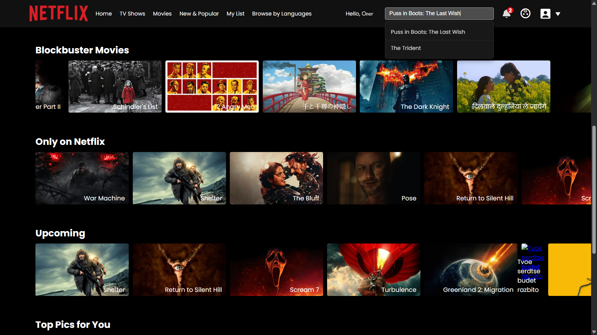
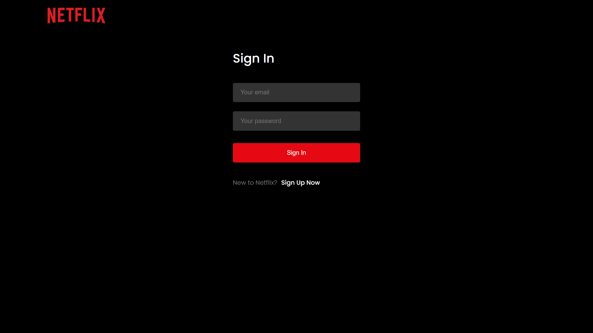
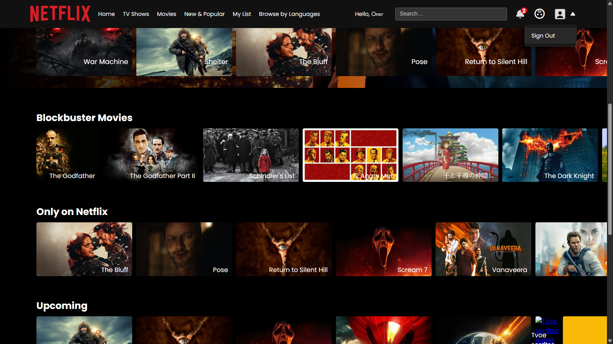
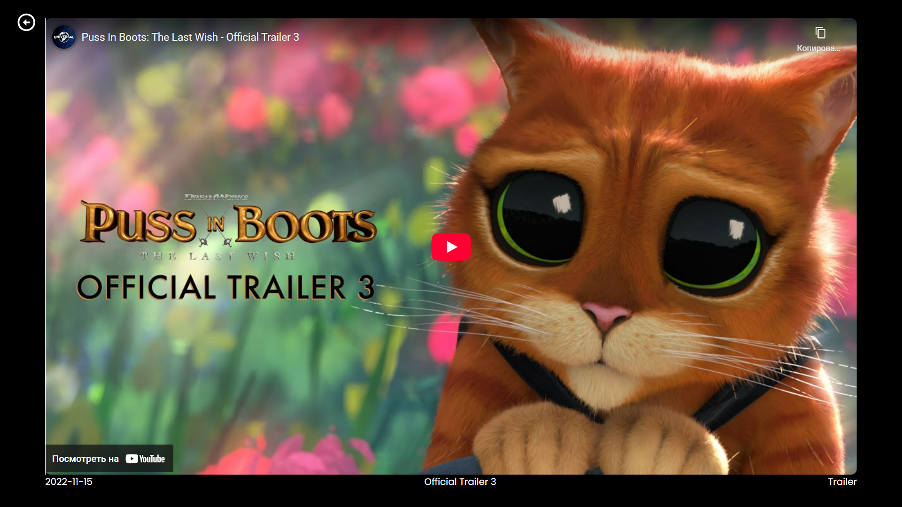

# Netflix Клон (React)

UI-проект, похожий на Netflix, построен с использованием React, Firebase Authentication и TMDB API.  
Вдохновлён видео-уроком YouTube-канала GreatStack, но с моими доработками: добавлен поисковик и система аутентификации, которая запоминает имя пользователя.

## Live Demo
[Посмотреть проект на Vercel](https://netflexclone-l9i95do1f-olegs-projects-dbc9c07d.vercel.app/)

## Функционал
- Регистрация и вход пользователя (Firebase) с отображением имени
- Поиск фильмов и сериалов
- Данные о фильмах через TMDB API
- Горизонтальная прокрутка рядов с фильмами
- Адаптивный интерфейс под мобильные и десктоп
- **Пока доступно только просмотр трейлеров фильмов и сериалов** — большинство англоязычных можно посмотреть, но не всё

## Технологии
- React
- Firebase Auth
- TMDB API
- Vite

## Скриншоты

  
  
  
  
  
  

## Ограничения
- Некоторые фильмы и сериалы могут быть недоступны для просмотра
- Пока поддерживаются только англоязычные трейлеры
- Проект на стадии MVP

## Источник вдохновения
Проект вдохновлён видео-уроком YouTube-канала GreatStack, но реализованные функции и модификации — мои собственные.  

### Видео:
[Full Stack Netflix Clone using React JS & Firebase | Build Website Like Netflix in React JS 2024](https://www.youtube.com/watch?v=YQQD67N5pi0&t=4s)

## Установка и запуск
1. Клонируйте репозиторий:  
   ```bash
   git clone https://github.com/op7en/netflexclone1.git
   cd netflexclone1/react-app
